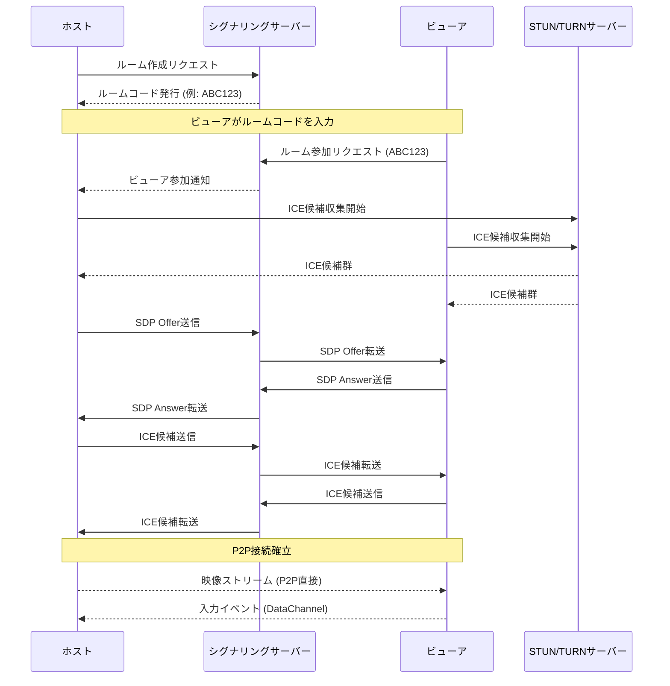

# P2D - P2Pデスクトップ共有ソフトウェア仕様書

**バージョン:** 1.0  
**作成日:** 2026年1月10日  
**ステータス:** ドラフト

---

## 目次

1. [プロジェクト概要](#1-プロジェクト概要)
2. [機能要件](#2-機能要件)
3. [非機能要件](#3-非機能要件)
4. [システムアーキテクチャ](#4-システムアーキテクチャ)
5. [技術スタック](#5-技術スタック)
6. [セキュリティ要件](#6-セキュリティ要件)
7. [画面設計](#7-画面設計)
8. [通信プロトコル](#8-通信プロトコル)
9. [開発ロードマップ](#9-開発ロードマップ)

---

## 1. プロジェクト概要

### 1.1 目的

P2D（Peer-to-Peer Desktop）は、中央サーバーを介さずに直接ピア間でデスクトップ画面を共有することを可能にするアプリケーションである。リモートワーク、ペアプログラミング、技術サポートなどのユースケースを想定している。

### 1.2 プロジェクトの目標

- **低遅延**: サーバー中継を排除し、ピア間直接通信により遅延を最小化
- **プライバシー重視**: 第三者サーバーに画面データが送信されないセキュアな共有
- **シンプルなUX**: 複雑な設定なしですぐに使える直感的なインターフェース
- **クロスプラットフォーム**: Windows, macOS, Linuxで動作

### 1.3 用語定義

| 用語         | 定義                                      |
| ------------ | ----------------------------------------- |
| ホスト       | 画面を共有する側のピア                    |
| ビューア     | 画面を閲覧する側のピア                    |
| シグナリング | P2P接続を確立するための初期ハンドシェイク |
| STUN/TURN    | NAT越えのためのプロトコル                 |

---

## 2. 機能要件

### 2.1 コア機能

#### 2.1.1 画面共有

| 機能ID | 機能名             | 説明                               | 優先度 |
| ------ | ------------------ | ---------------------------------- | ------ |
| F-001  | 全画面共有         | デスクトップ全体を共有する         | 必須   |
| F-002  | ウィンドウ選択共有 | 特定のウィンドウのみを共有する     | 必須   |
| F-003  | モニター選択       | マルチモニター環境で共有対象を選択 | 高     |
| F-004  | 解像度調整         | 帯域幅に応じた解像度の自動調整     | 高     |
| F-005  | フレームレート設定 | 15/30/60 FPSから選択可能           | 中     |

#### 2.1.2 接続管理

| 機能ID | 機能名           | 説明                          | 優先度 |
| ------ | ---------------- | ----------------------------- | ------ |
| F-010  | ルームコード生成 | 6桁の一意な接続コードを生成   | 必須   |
| F-011  | コード入力接続   | ルームコードを入力して接続    | 必須   |
| F-012  | QRコード接続     | QRコードスキャンによる接続    | 中     |
| F-013  | 接続履歴         | 過去の接続先を記憶            | 低     |
| F-014  | 複数ビューア対応 | 1つのホストに複数視聴者が接続 | 中     |

#### 2.1.3 リモートコントロール（オプション）

| 機能ID | 機能名             | 説明                               | 優先度 |
| ------ | ------------------ | ---------------------------------- | ------ |
| F-020  | マウス操作         | ビューアからのマウス操作を送信     | 中     |
| F-021  | キーボード入力     | ビューアからのキーボード入力を送信 | 中     |
| F-022  | 操作権限管理       | ホスト側でリモート操作の許可/拒否  | 必須*  |
| F-023  | クリップボード共有 | 双方向のクリップボードコピー       | 低     |

> ※ F-022はリモートコントロール機能を実装する場合は必須

#### 2.1.4 音声・チャット

| 機能ID | 機能名           | 説明                                | 優先度 |
| ------ | ---------------- | ----------------------------------- | ------ |
| F-030  | 音声通話         | WebRTCによるボイスチャット          | 中     |
| F-031  | システム音声共有 | PCのシステム音声を共有              | 高     |
| F-032  | テキストチャット | DataChannelによるテキストメッセージ | 中     |

### 2.2 補助機能

| 機能ID | 機能名             | 説明                                   | 優先度 |
| ------ | ------------------ | -------------------------------------- | ------ |
| F-040  | 接続統計表示       | 遅延、ビットレート、パケットロスを表示 | 高     |
| F-041  | スクリーンショット | ビューア側で画面をキャプチャ           | 低     |
| F-042  | 録画機能           | 共有セッションを録画                   | 低     |
| F-043  | ホワイトボード     | 画面上に描画してポイント               | 低     |

### 2.3 Discord連携

#### 2.3.1 Discord Rich Presence

| 機能ID | 機能名         | 説明                                    | 優先度 |
| ------ | -------------- | --------------------------------------- | ------ |
| F-050  | プレゼンス表示 | 画面共有中にDiscordステータスを更新     | 高     |
| F-051  | 参加ボタン     | Discordから直接画面共有セッションに参加 | 高     |
| F-052  | 招待機能       | DiscordフレンドをP2Dセッションに招待    | 中     |

**Rich Presence 表示例:**
```
🖥️ P2D - 画面共有中
━━━━━━━━━━━━━━━━━━━━━━━
ホスト: ユーザー名
視聴者: 2人
経過時間: 00:15:32

[参加する] [招待をリクエスト]
```

#### 2.3.2 Webhook通知

| 機能ID | 機能名             | 説明                                   | 優先度 |
| ------ | ------------------ | -------------------------------------- | ------ |
| F-055  | セッション開始通知 | 共有開始時にDiscordチャンネルに通知    | 中     |
| F-056  | 参加/退出通知      | ビューアの参加・退出をリアルタイム通知 | 低     |
| F-057  | カスタムWebhook    | サーバー管理者が設定したWebhookに送信  | 中     |

**Webhook通知例（Embed）:**
```json
{
  "embeds": [{
    "title": "🖥️ 画面共有セッションが開始されました",
    "color": 5793266,
    "fields": [
      { "name": "ホスト", "value": "ユーザー名", "inline": true },
      { "name": "ルームコード", "value": "ABC123", "inline": true }
    ],
    "footer": { "text": "P2D Desktop Sharing" },
    "timestamp": "2026-01-10T10:00:00.000Z"
  }],
  "components": [{
    "type": 1,
    "components": [{
      "type": 2,
      "label": "参加する",
      "style": 5,
      "url": "p2d://join/ABC123"
    }]
  }]
}
```

#### 2.3.3 Discord認証（オプション）

| 機能ID | 機能名               | 説明                                  | 優先度 |
| ------ | -------------------- | ------------------------------------- | ------ |
| F-060  | OAuth2認証           | Discordアカウントでログイン           | 低     |
| F-061  | フレンド制限         | Discordフレンドのみ接続許可           | 低     |
| F-062  | サーバーメンバー制限 | 特定Discordサーバーのメンバーのみ許可 | 低     |

#### 2.3.4 実装詳細

| 項目               | 技術                      | 備考                                       |
| ------------------ | ------------------------- | ------------------------------------------ |
| Rich Presence      | discord-rpc / discord-ipc | Discordデスクトップアプリ連携              |
| Webhook            | Discord Webhook API       | HTTPS POST                                 |
| OAuth2             | Discord OAuth2            | スコープ: `identify`, `relationships.read` |
| カスタムプロトコル | `p2d://`                  | ディープリンクでセッション参加             |

---

## 3. 非機能要件

### 3.1 パフォーマンス

| 要件ID | 項目         | 要件値                                |
| ------ | ------------ | ------------------------------------- |
| NF-001 | 映像遅延     | LAN環境: < 50ms、WAN環境: < 200ms     |
| NF-002 | 接続確立時間 | < 3秒（ネットワーク条件良好時）       |
| NF-003 | CPU使用率    | エンコード時: < 30%（ミドルレンジPC） |
| NF-004 | メモリ使用量 | < 500MB                               |
| NF-005 | 対応解像度   | 最大4K (3840x2160)                    |

### 3.2 GPUアクセラレーション

GPUが利用可能な場合、ハードウェアエンコーディング/デコーディングを活用してCPU負荷を大幅に軽減する。

#### 3.2.1 対応ハードウェアエンコーダ

| GPU ベンダー | 技術名           | 対応コーデック     | 備考                        |
| ------------ | ---------------- | ------------------ | --------------------------- |
| NVIDIA       | **NVENC**        | H.264, H.265, AV1* | *RTX 40シリーズ以降         |
| AMD          | **VCE/AMF**      | H.264, H.265       | Radeon RX 5000以降推奨      |
| Intel        | **Quick Sync**   | H.264, H.265, AV1* | *Arc GPU / 第12世代Core以降 |
| Apple        | **VideoToolbox** | H.264, H.265       | M1/M2チップ最適化           |

#### 3.2.2 エンコーディング戦略

```
1. コーデック優先度: AV1 > H.265 > H.264 > VP9 > VP8

2. GPU検出フロー
   ├── AV1ハードウェア対応? → AV1エンコード (最優先)
   ├── NVENC利用可能?       → H.265/H.264
   ├── AMF利用可能?         → H.265/H.264
   ├── QSV利用可能?         → AV1*/H.265/H.264
   └── いずれもなし         → ソフトウェアlibaom-av1 or VP9

* Intel Arc/第12世代Core以降QSVはAV1ハードウェアエンコード対応
```

#### 3.2.3 パフォーマンス目標（GPU使用時）

| 要件ID | 項目                | GPU使用時 | CPU使用時 |
| ------ | ------------------- | --------- | --------- |
| NF-006 | CPU使用率 (1080p60) | < 5%      | < 30%     |
| NF-007 | GPU使用率           | < 40%     | N/A       |
| NF-008 | エンコード遅延      | < 5ms     | < 15ms    |
| NF-009 | 4K60対応            | ✅ 対応    | ⚠️ 高負荷  |

#### 3.2.4 実装方針

- **自動検出**: アプリ起動時にGPU能力を検出し、最適なエンコーダを自動選択
- **手動オーバーライド**: 設定画面でエンコーダを手動選択可能
- **グレースフルフォールバック**: GPUエンコーダ失敗時は自動でソフトウェアエンコードに切替
- **デコード側**: ビューア側でもハードウェアデコードを活用（VideoDecoder API）

### 3.3 信頼性

| 要件ID | 項目                         | 要件値                         |
| ------ | ---------------------------- | ------------------------------ |
| NF-010 | 自動再接続                   | 接続断後5秒以内に再接続試行    |
| NF-011 | グレースフルデグラデーション | 帯域低下時に自動で品質を下げる |

### 3.4 ユーザビリティ

| 要件ID | 項目           | 要件値                        |
| ------ | -------------- | ----------------------------- |
| NF-020 | 初回起動時間   | < 3秒                         |
| NF-021 | 操作ステップ数 | 画面共有開始まで3クリック以内 |

### 3.5 互換性

| 要件ID | 項目             | 要件値                                  |
| ------ | ---------------- | --------------------------------------- |
| NF-030 | 対応OS           | Windows 10/11、macOS 12+、Ubuntu 20.04+ |
| NF-031 | 必須ネットワーク | IPv4/IPv6対応                           |

---

## 4. システムアーキテクチャ

### 4.1 全体構成

```
┌─────────────────┐         ┌─────────────────┐
│                 │         │                 │
│  ホスト (Host)  │◄───────►│ ビューア (Viewer)│
│                 │  P2P    │                 │
│  ┌───────────┐  │ WebRTC  │  ┌───────────┐  │
│  │ Screen    │  │         │  │ Video     │  │
│  │ Capture   │──┼─────────┼──┤ Renderer  │  │
│  └───────────┘  │         │  └───────────┘  │
│                 │         │                 │
│  ┌───────────┐  │  Data   │  ┌───────────┐  │
│  │ Input     │◄─┼─Channel─┼──┤ Input     │  │
│  │ Receiver  │  │         │  │ Sender    │  │
│  └───────────┘  │         │  └───────────┘  │
│                 │         │                 │
└────────┬────────┘         └────────┬────────┘
         │                           │
         │    ┌───────────────┐      │
         └───►│ Signaling     │◄─────┘
              │ Server        │
              │ (WebSocket)   │
              └───────┬───────┘
                      │
              ┌───────┴───────┐
              │ STUN/TURN     │
              │ Server        │
              └───────────────┘
```

### 4.2 コンポーネント構成

#### 4.2.1 デスクトップアプリケーション（Electron/Tauri）

```
P2D Application
├── Main Process
│   ├── Window Manager         # ウィンドウ管理
│   ├── Screen Capture Module  # 画面キャプチャ（OS API）
│   ├── Input Injection        # リモート入力の注入
│   └── IPC Handler            # プロセス間通信
│
├── Renderer Process
│   ├── UI Layer (React)       # ユーザーインターフェース
│   ├── WebRTC Manager         # P2P接続管理
│   ├── Media Handler          # 映像・音声ストリーム処理
│   └── DataChannel Handler    # データチャネル処理
│
└── Preload Scripts
    └── Secure Bridge          # セキュアなAPI公開
```

#### 4.2.2 シグナリングサーバー

```
Signaling Server (Node.js/WebSocket)
├── Room Manager               # ルームの作成・管理
├── Session Handler            # セッション管理
├── SDP Relay                  # SDP (Session Description Protocol) 中継
└── ICE Candidate Relay        # ICE候補の中継
```

### 4.3 通信フロー



---

## 5. 技術スタック

### 5.1 フロントエンド（デスクトップ）

| レイヤー       | 技術                   | 選定理由                               |
| -------------- | ---------------------- | -------------------------------------- |
| フレームワーク | **Tauri 2.0**          | 軽量・セキュア・ネイティブ機能アクセス |
| UI             | **React + TypeScript** | コンポーネント設計、型安全性           |
| 状態管理       | **Zustand**            | シンプルで軽量                         |
| スタイリング   | **Tailwind CSS**       | 迅速なUI開発                           |
| バックエンド   | **Rust**               | システムAPIアクセス、高性能            |

### 5.2 WebRTC関連

| 機能           | 技術/ライブラリ                  | 備考                            |
| -------------- | -------------------------------- | ------------------------------- |
| 画面キャプチャ | Tauri + OSネイティブAPI          | Windows: DXGI, macOS: CGDisplay |
| P2P通信        | WebRTC (RTCPeerConnection)       | webrtc-rsまたはChromium埋込     |
| データ転送     | RTCDataChannel                   | リモート入力、チャット用        |
| 映像コーデック | **AV1 (最優先)** > H.265 > H.264 | 帯域効率重視、GPUエンコード     |

### 5.3 バックエンド（シグナリング）

| 機能       | 技術                             |
| ---------- | -------------------------------- |
| サーバー   | **Node.js** + **TypeScript**     |
| WebSocket  | **ws** または **Socket.io**      |
| ルーム管理 | In-memory (Redis検討)            |
| デプロイ   | Cloudflare Workers / Deno Deploy |

### 5.4 インフラストラクチャ

| 機能 | 技術                  | 詳細                               |
| ---- | --------------------- | ---------------------------------- |
| STUN | Google公開STUN        | `stun:stun.l.google.com:19302`     |
| TURN | **coturn (自前構築)** | Dockerでデプロイ、UDP 3478/TCP 443 |
| CDN  | Cloudflare            | アプリ配布用                       |

### 5.5 パッケージング

| OS      | 技術                 |
| ------- | -------------------- |
| Windows | NSIS / MSI           |
| macOS   | DMG / PKG            |
| Linux   | AppImage / deb / rpm |

---

## 6. セキュリティ要件

### 6.1 通信セキュリティ

| 要件ID  | 項目         | 要件                                           |
| ------- | ------------ | ---------------------------------------------- |
| SEC-001 | 暗号化       | すべての通信はDTLS 1.2/SRTP暗号化              |
| SEC-002 | 証明書       | WebRTC接続時にDTLS証明書フィンガープリント検証 |
| SEC-003 | シグナリング | WSS (WebSocket Secure) 必須                    |

### 6.2 アクセス制御

| 要件ID  | 項目         | 要件                         |
| ------- | ------------ | ---------------------------- |
| SEC-010 | ルームコード | 6桁英数字、5分でタイムアウト |
| SEC-011 | 接続承認     | ホストが明示的に接続を許可   |
| SEC-012 | 最大接続数   | 1ルームあたり最大5ビューア   |

### 6.3 プライバシー

| 要件ID  | 項目       | 要件                                                     |
| ------- | ---------- | -------------------------------------------------------- |
| SEC-020 | データ保存 | シグナリングサーバーに映像データを保存しない             |
| SEC-021 | ログ       | 接続メタデータのみログ、IPアドレス匿名化                 |
| SEC-022 | 共有領域   | 敏感なウィンドウ（パスワード入力等）の自動除外オプション |

### 6.4 リモートコントロール

| 要件ID  | 項目               | 要件                                              |
| ------- | ------------------ | ------------------------------------------------- |
| SEC-030 | 権限の粒度         | 閲覧のみ / マウス許可 / キーボード許可 を選択可能 |
| SEC-031 | 緊急停止           | ESCキー長押しでリモート操作を即座に無効化         |
| SEC-032 | 視覚フィードバック | リモート操作中は画面端にインジケーター表示        |

---

## 7. 画面設計

### 7.1 メイン画面（ホスト）

```
┌─────────────────────────────────────────────────────┐
│  P2D - Peer-to-Peer Desktop Sharing           ─ □ ✕ │
├─────────────────────────────────────────────────────┤
│                                                     │
│     ┌─────────────────────────────────────┐         │
│     │                                     │         │
│     │         🖥️  デスクトップ             │         │
│     │            プレビュー               │         │
│     │                                     │         │
│     └─────────────────────────────────────┘         │
│                                                     │
│     [🖵 全画面共有] [📱 ウィンドウ選択] [⚙️ 設定]   │
│                                                     │
│  ───────────────── 接続情報 ─────────────────       │
│                                                     │
│     ルームコード:  [ A B C 1 2 3 ]   [📋 コピー]    │
│     接続URL:       p2d.link/ABC123   [📋]          │
│     QRコード:      [QR]                             │
│                                                     │
│  ───────────────── 接続中のユーザー ────────────    │
│                                                     │
│     👤 User1 (192.168.x.x) [🔇][❌]                 │
│     👤 User2 (10.0.x.x)    [🔇][❌]                 │
│                                                     │
└─────────────────────────────────────────────────────┘
```

### 7.2 メイン画面（ビューア）

```
┌─────────────────────────────────────────────────────┐
│  P2D - Viewer                                 ─ □ ✕ │
├─────────────────────────────────────────────────────┤
│                                                     │
│     ┌───────────────────────────────────────────┐   │
│     │                                           │   │
│     │                                           │   │
│     │         共有画面表示エリア                │   │
│     │         (16:9 アスペクト比)               │   │
│     │                                           │   │
│     │                                           │   │
│     └───────────────────────────────────────────┘   │
│                                                     │
│   [🔲 フルスクリーン] [📷 キャプチャ] [⚙️ 設定]    │
│                                                     │
│  ────────────────── 統計情報 ───────────────────    │
│   遅延: 45ms  |  ビットレート: 2.4Mbps  |  FPS: 30  │
│                                                     │
└─────────────────────────────────────────────────────┘
```

### 7.3 接続ダイアログ（ビューア）

```
┌───────────────────────────────────────┐
│  接続                            ✕    │
├───────────────────────────────────────┤
│                                       │
│   ルームコードを入力:                 │
│   ┌───┬───┬───┬───┬───┬───┐          │
│   │ A │ B │ C │ 1 │ 2 │ 3 │          │
│   └───┴───┴───┴───┴───┴───┘          │
│                                       │
│   または URLを入力:                   │
│   ┌────────────────────────────────┐  │
│   │ p2d.link/ABC123               │  │
│   └────────────────────────────────┘  │
│                                       │
│         [🔌 接続]  [📷 QR読取]        │
│                                       │
└───────────────────────────────────────┘
```

---

## 8. 通信プロトコル

### 8.1 シグナリングメッセージ形式

```typescript
// メッセージベースタイプ
interface SignalingMessage {
  type: MessageType;
  roomId: string;
  senderId: string;
  timestamp: number;
  payload: unknown;
}

// メッセージタイプ定義
type MessageType = 
  | 'room:create'      // ルーム作成
  | 'room:join'        // ルーム参加
  | 'room:leave'       // ルーム退出
  | 'peer:offer'       // SDP Offer
  | 'peer:answer'      // SDP Answer
  | 'peer:ice'         // ICE候補
  | 'error';           // エラー

// 例: SDPオファー
interface OfferMessage extends SignalingMessage {
  type: 'peer:offer';
  payload: {
    sdp: RTCSessionDescriptionInit;
    mediaConstraints: MediaConstraints;
  };
}
```

### 8.2 DataChannelプロトコル

```typescript
// DataChannelメッセージ形式
interface DataChannelMessage {
  type: DataChannelMessageType;
  timestamp: number;
  data: unknown;
}

type DataChannelMessageType =
  | 'input:mouse'      // マウスイベント
  | 'input:keyboard'   // キーボードイベント
  | 'input:clipboard'  // クリップボードデータ
  | 'control:pause'    // 一時停止
  | 'control:resume'   // 再開
  | 'chat:message'     // チャットメッセージ
  | 'stats:request'    // 統計情報リクエスト
  | 'stats:response';  // 統計情報レスポンス

// 例: マウス移動
interface MouseMoveMessage extends DataChannelMessage {
  type: 'input:mouse';
  data: {
    action: 'move';
    x: number;  // 0.0 - 1.0 (相対座標)
    y: number;
  };
}
```

---

## 9. 開発ロードマップ

### Phase 1: MVP（4週間）

#### Week 1-2: 基盤構築
- [ ] プロジェクト初期化（Tauri + React）
- [ ] シグナリングサーバー実装
- [ ] 基本的なWebRTC接続確立

#### Week 3-4: コア機能
- [ ] 全画面共有の実装
- [ ] 基本的なビューア画面
- [ ] ルームコードによる接続

### Phase 2: 機能拡充（3週間）

#### Week 5-6
- [ ] ウィンドウ選択共有
- [ ] モニター選択
- [ ] 解像度・FPS設定

#### Week 7
- [ ] DataChannel実装
- [ ] リモートマウス操作（オプション）

### Phase 3: 品質向上（2週間）

#### Week 8
- [ ] 自動再接続
- [ ] 帯域幅適応
- [ ] 接続統計UI

#### Week 9
- [ ] クロスプラットフォームテスト
- [ ] パッケージング
- [ ] ドキュメント整備

---

## 変更履歴

| バージョン | 日付       | 変更内容                                | 著者 |
| ---------- | ---------- | --------------------------------------- | ---- |
| 1.1        | 2026-01-10 | AV1優先、Tauri 2.0固定、Discord連携追加 | AI   |
| 1.0        | 2026-01-10 | 初版作成                                | AI   |

---

> [!NOTE]
> この仕様書はドラフト版です。実装過程で要件の追加・変更が発生する可能性があります。
